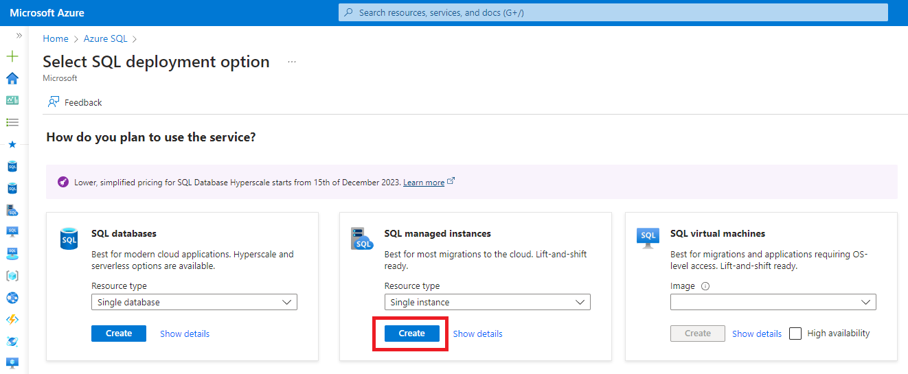
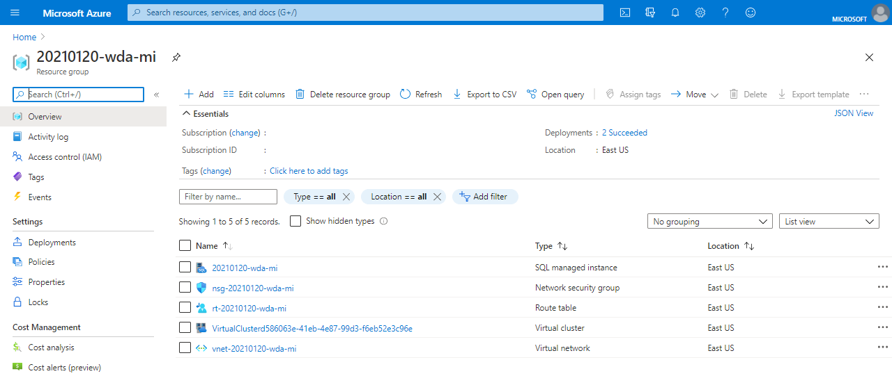

# resumo-do-lab & criando máquinas virtuais azure
Este repositório contém o resumo das lições aprendidas durante o desenvolvimento do lab na DIO

Foi possível compreender os conceitos básicos relacionados a computação em nuvem, como os modelos de implatantação utilizados por empresas, sendo eles divididos em:
1 - Nuvem Pública
Infraestrutura compartilhada, como AWS, Azure, Google Cloud.

2 - Nuvem Privada
Infraestrutura usada por uma única organização, hospedada internamente ou por terceiros.

3 - Nuvem Híbrida
Combinação de nuvem pública e privada, permitindo mover dados e aplicações entre elas.

Além disso, ficou claro que a computação em nuvem possui características muito únicas e viáveis para todo tipo de empresa:

1 - Elasticidade
A nuvem pode aumentar ou reduzir recursos automaticamente, conforme a demanda.

2 - Escalabilidade
Permite crescer (ou reduzir) a infraestrutura de forma rápida e simples, horizontalmente (mais máquinas) ou verticalmente (máquinas mais potentes).

3 - Alta disponibilidade
Os serviços ficam disponíveis a maior parte do tempo, com redundância geográfica e failover automático.

4 - Pagamento conforme o uso (Pay-as-you-go)
Você paga apenas pelos recursos que realmente usa, como energia ou água.

5 - Gerenciabilidade
Você pode controlar e monitorar seus recursos facilmente via portais, APIs ou linha de comando.

6 - Segurança
As nuvens públicas oferecem criptografia, controle de acesso e outras medidas de proteção de dados.

## Criação de máquina virtual

Criar uma máquina virtual na Azure

1 - No campo de pesquisa do portal, digite “máquinas virtuais”.

2 - Em Serviços, clique na opção Máquinas virtuais.

3 - Na página que se abrir, selecione o botão Criar e escolha Máquina virtual do Azure. Isso abrirá o assistente de criação da VM.

4 - Na seção Detalhes da instância, preencha o campo Nome da máquina virtual com myVM e selecione a imagem Windows Server 2022 Datacenter: Azure Edition - x64 Gen 2. Os demais campos podem ser deixados com as configurações padrão.

5 - Na seção Conta de administrador, digite um nome de usuário (por exemplo, azureuser) e crie uma senha segura. A senha deve ter pelo menos 12 caracteres e atender aos critérios de complexidade exigidos pelo sistema.

6 - Em Regras de porta de entrada, selecione a opção Permitir portas selecionadas. No menu suspenso, marque as portas RDP (3389) e HTTP (80).

7 - Mantenha os demais campos com as configurações padrão e clique no botão Examinar + criar, localizado ao final da página.

8 - Após a verificação das configurações, clique em Criar para iniciar a implantação da máquina virtual.

9 - Quando o processo for concluído, clique em Ir para o recurso para acessar diretamente a nova VM criada.

## Criar Banco de Dados SQL

# Pré-requisitos

1. É necessário possuir uma assinatura ativa do Azure. Caso ainda não tenha, é possível criar uma conta gratuita.
2. É preciso utilizar o módulo Az.SQL mais atualizado compatível com a versão atual do PowerShell, ou então a última versão da CLI do Azure. 

Para verificar restrições e compatibilidade, consulte as páginas sobre regiões disponíveis e tipos de assinatura suportados.
Criação de uma Instância Gerenciada de SQL no Azure

A implantação da Instância Gerenciada de SQL no Azure pode ser feita por meio do portal do Azure, PowerShell ou CLI do Azure.
# Considerações importantes

* É possível interromper o processo de criação utilizando o portal, o PowerShell, a CLI do Azure ou ferramentas baseadas na API REST.

* A implantação pode sofrer atrasos se houver outras atividades em andamento na mesma sub-rede, como uma restauração demorada ou o redimensionamento de outra instância.

* Para visualizar a instância gerenciada dentro do grupo de recursos, é necessário possuir permissões de leitura nesse grupo.

# Acessando o Portal do Azure

Para iniciar a criação da sua instância pelo portal do Azure, é necessário acessar a plataforma e preencher os dados solicitados na tela de criação da Instância Gerenciada de SQL do Azure.

Siga os passos abaixo:

1 - Acesse o portal do Azure com sua conta.

2 - No menu lateral do portal, clique em SQL do Azure.
Caso essa opção não apareça de imediato, vá em Todos os serviços e digite SQL do Azure na barra de pesquisa.

3 - Clique em + Criar para abrir a tela Selecionar opção de implantação do SQL.
Se quiser saber mais sobre esse tipo de instância, clique em Mostrar detalhes no bloco de Instâncias Gerenciadas de SQL.

4 - No menu suspenso, selecione Instância única e, em seguida, clique em Criar para acessar a página onde será configurada a Instância Gerenciada de SQL do Azure.

# Guia Básico 

Em Detalhes da instância gerenciada, selecione Configurar instância gerenciada na seção Computação + armazenamento para abrir a página Computação + armazenamento.

Após a conclusão da implantação, navegue até o grupo de recursos para exibir a instância gerenciada:

# Passos para usar o Azure Speech Studio

1 - Acesse https://speech.microsoft.com e faça login com sua conta Azure.

2 - Crie ou vincule um recurso de Fala no painel “My resources”.

3 - Copie a Key e o Endpoint em “Keys & Endpoint”.

4 - Teste o Speech-to-Text enviando um áudio ou usando o microfone.

5 - Teste o Text-to-Speech digitando um texto e clicando em “Play”.

6 - Explore recursos avançados como Custom Voice, Speech Translation e SDKs.

# Passos para usar o Azure Language Studio

1 - Acesse https://language.cognitive.azure.com e faça login com sua conta Azure.

2 - Adicione um recurso de Azure AI Language em “+ Add resource”.

3 - Copie a Key e o Endpoint em “Keys and Endpoint”.

4 - Experimente Text Analytics: Detecção de idioma, Sentimento e Extração de frases-chave.

5 - Crie um projeto de Question Answering importando FAQs ou documentos.

6 - Treine e publique modelos customizados em “Custom text classification” ou “Custom entity recognition”.

# Passos para usar o Azure AI Search

1 - Acesse o portal do Azure e crie um recurso Azure AI Search.

2 - Configure um recurso Azure AI Services na mesma região para fornecer as habilidades de enriquecimento.

3 - Crie uma Storage Account com um container de blobs e habilite acesso anônimo para armazenar seus documentos.

4 - Faça o upload dos arquivos (por ex., avaliações de clientes) para o container de blobs.

5 - Use o assistente Import data para definir a fonte de dados, anexar o skillset de AI e gerar o index e o indexer.

6 - Execute e monitore o indexer até que o status indique sucesso na indexação.

7 - Abra o Search explorer no portal para escrever consultas e validar os resultados do seu índice.

8 - Acesse o Knowledge Store na Storage Account para revisar os dados enriquecidos guardados em projeções e tabelas.

# Passos básicos para explorar IA generativa no Azure AI Foundry

1 - Acesse https://ai.azure.com e faça login com suas credenciais do Azure.

2 - Navegue até https://ai.azure.com/managementCenter/allResources e clique em Create para adicionar um novo recurso de AI hub.

3 - No assistente Create a project, informe um nome válido para o projeto e selecione a opção para criar um novo hub.

4 - Expanda Advanced options e defina Subscription, Resource group e uma das regiões suportadas (por exemplo, East US, West Europe).

5 - Aguarde a conclusão da criação do projeto e acesse a página de Overview do seu projeto.

6 - No menu lateral, selecione Playgrounds para experimentar interfaces interativas de IA generativa.

7 - Em Chat playground, clique em Create a deployment, pesquise por gpt-4 e selecione Deploy.

8 - Após o deploy, escolha seu modelo em Deployment e clique em Apply changes para habilitar o uso no playground.

9 - Teste vários prompts em sequência para: planejamento de viagem, sugestões de local, informações de restaurante, uso de fonte externa, contexto adicional e definição de expectativas.

# Passos básicos para explorar o Azure AI Studio

1 - Acesse https://ai.azure.com/studio e faça login com suas credenciais do Azure.

2 - Clique em "Create a new project" e configure o nome, AI hub, resource group e região (como East US).

3 - Após a criação, acesse o projeto e vá para a aba Overview para explorar os recursos disponíveis.

4 - No menu lateral, clique em Playground para testar modelos pré-prontos como GPT e DALL-E.

5 - Experimente gerar imagens, analisar texto e testar modelos de IA generativa com prompts variados.

6 - Navegue até a seção Prompt flow para visualizar e editar fluxos de prompt com entradas e saídas.

7 - Explore seções como Datasets e Deployments para entender a estrutura de dados e como implantar modelos.

# Passos básicos para explorar filtros de conteúdo no Azure AI Studio

1 - Acesse seu projeto no Azure AI Studio em https://ai.azure.com/studio e vá para a seção Playground.

2 - Crie um novo Chat playground com base no modelo GPT-4.

3 - No painel lateral, localize a aba Content filters e ative os filtros desejados (como Hate, Violence, Sexual).

4 - Configure o nível de sensibilidade dos filtros (Low, Medium, High) para personalizar a resposta aos conteúdos gerados.

5 - Envie prompts deliberadamente sensíveis (ex: linguagem imprópria) para verificar a moderação automática.

6 - Observe os avisos ou bloqueios exibidos no painel de resposta e revise os logs de moderação.

7 - Ajuste os filtros conforme as políticas e o público-alvo do seu aplicativo de IA generativa.
