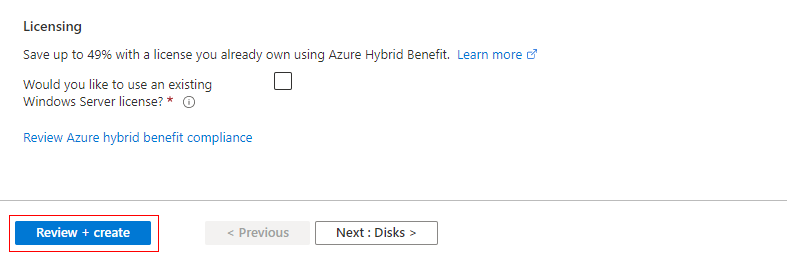

# resumo-do-lab & criando máquinas virtuais azure
Este repositório contém o resumo das lições aprendidas durante o desenvolvimento do lab na DIO

Foi possível compreender os conceitos básicos relacionados a computação em nuvem, como os modelos de implatantação utilizados por empresas, sendo eles divididos em:
1 - Nuvem Pública
Infraestrutura compartilhada, como AWS, Azure, Google Cloud.

2 - Nuvem Privada
Infraestrutura usada por uma única organização, hospedada internamente ou por terceiros.

3 - Nuvem Híbrida
Combinação de nuvem pública e privada, permitindo mover dados e aplicações entre elas.

Além disso, ficou claro que a computação em nuvem possui características muito únicas e viáveis para todo tipo de empresa:

1 - Elasticidade
A nuvem pode aumentar ou reduzir recursos automaticamente, conforme a demanda.

2 - Escalabilidade
Permite crescer (ou reduzir) a infraestrutura de forma rápida e simples, horizontalmente (mais máquinas) ou verticalmente (máquinas mais potentes).

3 - Alta disponibilidade
Os serviços ficam disponíveis a maior parte do tempo, com redundância geográfica e failover automático.

4 - Pagamento conforme o uso (Pay-as-you-go)
Você paga apenas pelos recursos que realmente usa, como energia ou água.

5 - Gerenciabilidade
Você pode controlar e monitorar seus recursos facilmente via portais, APIs ou linha de comando.

6 - Segurança
As nuvens públicas oferecem criptografia, controle de acesso e outras medidas de proteção de dados.

## Criação de máquina virtual

Criar uma máquina virtual na Azure

1 - No campo de pesquisa do portal, digite “máquinas virtuais”.

2 - Em Serviços, clique na opção Máquinas virtuais.

3 - Na página que se abrir, selecione o botão Criar e escolha Máquina virtual do Azure. Isso abrirá o assistente de criação da VM.

4 - Na seção Detalhes da instância, preencha o campo Nome da máquina virtual com myVM e selecione a imagem Windows Server 2022 Datacenter: Azure Edition - x64 Gen 2. Os demais campos podem ser deixados com as configurações padrão.

5 - Na seção Conta de administrador, digite um nome de usuário (por exemplo, azureuser) e crie uma senha segura. A senha deve ter pelo menos 12 caracteres e atender aos critérios de complexidade exigidos pelo sistema.

6 - Em Regras de porta de entrada, selecione a opção Permitir portas selecionadas. No menu suspenso, marque as portas RDP (3389) e HTTP (80).

7 - Mantenha os demais campos com as configurações padrão e clique no botão Examinar + criar, localizado ao final da página.

8 - Após a verificação das configurações, clique em Criar para iniciar a implantação da máquina virtual.

9 - Quando o processo for concluído, clique em Ir para o recurso para acessar diretamente a nova VM criada.

